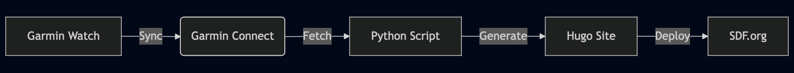

# 365 Days of Running

**A physical challenge documented by code.** On Dec 1 2024, I set a goal to run at least one mile every single day. To keep myself accountable, I built a custom automation pipeline that turns my Garmin watch data into a static blog hosted on SDF.org.

[**Visit the Live Blog →**](https://csprague.sdf.org/)

---

### The Architecture

I wanted a "set it and forget it" workflow. The system connects my physical activity to my digital footprint using the Unix philosophy: simple tools doing one thing well.



---

### How It Works

**1. Data Extraction** The Python script authenticates with the Garmin Connect API and pulls the latest activity data.

**2. Note Parsing** I enter a custom Note on Garmin Connect to split technical workout data from personal thoughts. 
The script parses this string:
```text
w: Intervals 4x400
c: Felt strong, humid weather.
```
It extracts these into separate Markdown frontmatter fields (`Workout` and `Comments`) using Regex, keeping the blog metadata clean.

**3. Static Generation** The script calculates the pace and distance in Imperial units, generates a Hugo-compatible Markdown file, and triggers a build.

**4. Hosting** The final HTML is served via **SDF.org**, a public access Unix system, keeping the project lightweight and rooted in open computing history.

---

### Project Statistics

| Metric | Result |
| :--- | :--- |
| **Goal** | Run 1 mile, every day |
| **Status** | Completed |
| **Total Distance** | Over 1,500 miles |
| **Longest Streak** | 365 Days |
| **Stack** | Python, Hugo, Bash |

---

### Usage

This script is designed to be menu-driven for safety, allowing you to review the activity before publishing.

```bash
# 1. Install requirements
pip install -r requirements.txt

# 2. Configure environment
export GARMIN_EMAIL="your@email.com"
export GARMIN_PASSWORD="yourpassword"

# 3. Run the generator
python main.py
```

### The Code

The core of the logic lies in the `write_post` function, which bridges the gap between raw JSON data and the Hugo content structure.

```python
# Snippet: Formatting the blog post content
frontmatter = f"""---
title: "{title}"
date: {start_date}
categories: post
tags: [{tags_formatted}]
---
{post_name} 
{distance:.2f} mi 
{duration_str} 
{pace_str}/mi 
Workout: {workout} 
Comments: {comment}
"""
```

---

*Hosted with pride on [SDF.org](https://sdf.org).*
