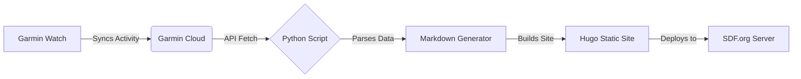

# garmin2hugo
Garmin2Hugo - A automated running blog

# 🏃‍♂️ Garmin2Hugo: An Automated Running Blog Streak Tracker Script Project Thing 


> **The Mission:** On Nov 1, 2024, I set a goal to run at least **1 mile every single day** for 365 days and learn a little Python along the way.
> **The Solution:** A Python automation tool that fetches activity data, parses my workout notes, and generates a static blog post instantly.

[**🔗 View the Live Blog Here**](https://csprague.sdf.org/)

---

## 📖 Project Overview

This repository contains the automation logic behind my "Run Every Day" challenge. Instead of manually updating a blog, I wrote a CLI tool that interacts with the Garmin Connect API to turn physical effort into digital documentation.

The system allows me to:
1.  **Sync** directly with Garmin.
2.  **Select** a recent run via an interactive CLI menu.
3.  **Parse** specific metadata (Workout type vs. Comments) directly from the notes I type into my watch.
4.  **Build** the Hugo site automatically and prepare it for deployment to [SDF.org](https://sdf.org).

### ⚙️ Architecture



---

## 🛠️ Key Features

### 1. Interactive CLI
The script uses `tabulate` to present a clean, menu-driven interface, allowing me to choose exactly which activity to publish.

### 2. Custom Data Parsing
I utilize a custom Regex pattern to split the notes field from my Garmin watch into two distinct blog fields: **Workout** and **Comments**.

* **Input in Garmin:** `w: Interval Training c: Felt strong today`
* **Output in Blog:** Splits into separate frontmatter fields.

### 3. Automated Stats Calculation
The script automatically converts raw API data (duration in seconds, distance in meters) into human-readable imperial units (Miles, Pace per Mile).

---

## 💻 Usage

If you wish to fork this to track your own running goals, follow these steps.

### Prerequisites
* Python 3.x
* Hugo installed on your machine
* A Garmin Connect account

### Installation

1.  **Clone the repository**
    ```bash
    git clone [https://gitlab.com/your-username/garmin-2-hugo.git](https://gitlab.com/your-username/garmin-2-hugo.git)
    cd garmin-2-hugo
    ```

2.  **Install Dependencies**
    ```bash
    pip install garminconnect python-dotenv tabulate python-dateutil requests
    ```

3.  **Configuration**
    Create a `.env` file in the root directory:
    ```env
    EMAIL=your.garmin.email@example.com
    PASSWORD=your_garmin_password
    ```

### Running the Script

```bash
python main.py
```

---

## 🧠 Code Highlight: Generating the Markdown

Because the script generates a Markdown file, I had to embed the formatting directly into the Python f-string.

````python
frontmatter = f"""---
title: "{title}"
summary: "{post_name}"
date: {start_date} {datetime.now().strftime("%H:%M:%S")}
categories: post
tags: [{tags_formatted}]
---
```
{post_name} 
{distance:.2f} mi 
{duration_str} 
{pace_str}/mi 
Workout: {workout} 
Comments: {comment}
```
"""
````

---

## 🏆 The "Run Every Day" Goal

This project was built to support a physical challenge. The consistency of the code mirrored the consistency required for the running.

* **Total Distance:** [Insert Total Miles]
* **Longest Streak:** [365 Days]
* **Tech Stack:** Python, Hugo, Bash

## 🤝 Acknowledgements

* **SDF.org:** For providing the pure Unix environment to host this site.
* **cyberjunkie:** For the `garminconnect` Python library.
